# Инструкция по работе с Git #

## Создание файла ##

1. Создать папку для хранения файлов.

2. Открыть данную папку в "VSD" с помощью проводника в левом верхнем углу.

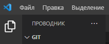

3. Создать файл в созданной ранее папке.

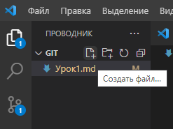

4. Для того чтобы Git начал контролировать то, что происходит в созданной папке, сохранял
версии и помогал в работе, надо дать ему команду отслеживание происходящего. Для этого надо запустить терминал. Перейдём в меню, найдём пункт «Терминал» (или "Вид" далее «Терминал»)

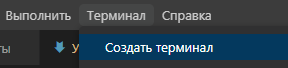

## Работа с файлом. ##

1. Для начало проверим, что Git настроен верно. Для этого наберем команду 
### *git --version* ###
Если Git установлен и
настроен правильно, увидим на экране текущую версию этой программы.

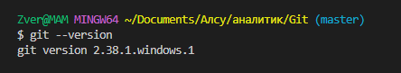

>### !!! Обязательно сохраняйте все свои изменения файла с помощью комбинации клавиш *Ctrl + S* или в строке "Меню"→ "Файл"→ "Сохранить" ###
-------------------------

2. Для того чтобы Git начал отслеживать всё, что будем делать в своей папке необходимо инициализировать Git,  запустив специальную команду.

### *git init* ###

В нашей папке Git начинает отслеживать все изменения. 
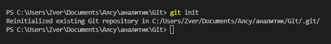
В папке должна появиться скрытая папка *.git* .

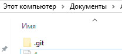

3.  Также мы можем узнать статус происходящего команой 
### *git status* ###

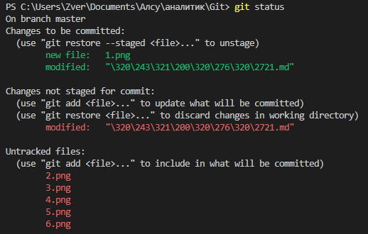

4. Далее согласно подсказам сообщения необходимо добавить неотслеживаемые файлы командой 
### *git add* ###
(add — «добавить») и указать какие-то
файлы, чтобы включить их в фиксацию. 
Чтобы добавить все файлы данной папки необходимо дополнить команду точкой.
### *git add .* ###

Ещё раз взглянем на статус:

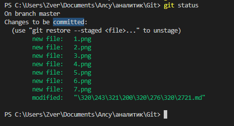

5. Далее согласно подсказам сообщения необходимо зафиксировать текущий статус командой

### *git commit* ###

И указываем некоторые комментарии, чтобы в дальнейшем понять, какое было сделано сохранение и для чего. Дополнив команду буквой *-m* — сокращение от message («сообщение») — и в кавычках запишем то, что
надо запомнить, некий комментарий к сохранению.

### *git commit -m "комментарий"* ###

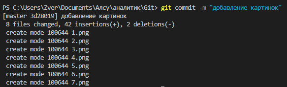

При работе с файлом есть необходимость вносить правки. После каждого изменения файла требуется фиксация статуса. Но для начала добавим новые файлы.

### *git add .* ###
### *git commit -m "комментарий"* ###

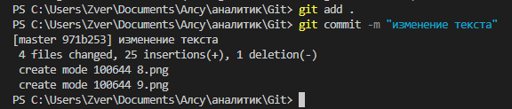

## Контроль версий ##

1. Теперь у нас есть уже два сохранения, с которыми можно работать. Появилась возможность переходить от одной версии файлов к другой, что нам. 
Но сначала посмотрим, какие версии существуют. Для этого используется специальная
команда 
### *git log* ## 
Log —  журнал изменений.

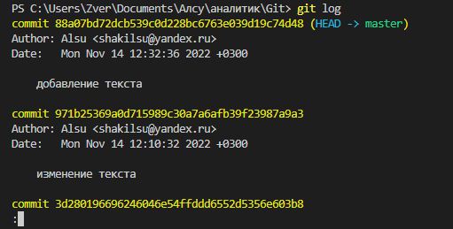

2. Если хотим перейти к предыдущей версии
файла, воспользуемся для этого указанным commit. Это очень непонятное сочетание букв и цифр, по которым можем перейти. Чтобы перейти к какой-то версии, сохранению, надо вызвать команду 

### *git checkout* ###

