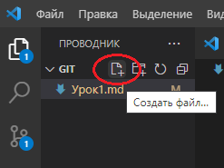

# Инструкция по работе с Git #

## Создание файла ##

1. Создать папку для хранения файлов.

2. Открыть данную папку в "VSD" с помощью проводника в левом верхнем углу.

3. Создать файл в созданной ранее папке.

4. Для того чтобы Git начал контролировать то, что происходит в созданной папке, сохранял
версии и помогал в работе, надо дать ему команду отслеживание происходящего. Для этого надо запустить терминал.

## Работа с файлом, контроль версий. ##

1. Для начало проверим, что Git настроен верно. Для этого наберем команду 
### *git --version* ###
Если Git установлен и
настроен правильно, увидим на экране текущую версию этой программы.

2. Для того чтобы Git начал отслеживать всё, что будем делать в своей папке необходимо инициализировать Git,  запустив специальную команду.

### *git init* ###

В нашей папке Git начинает отслеживать все изменения. 

В папке должна появиться скрытая папка *.git* .

3.  Также мы можем узнать статус происходящего команой 
### *git status* ###

4. Далее согласно подсказам сообщения необходимо добавить неотслеживаемые файлы.
